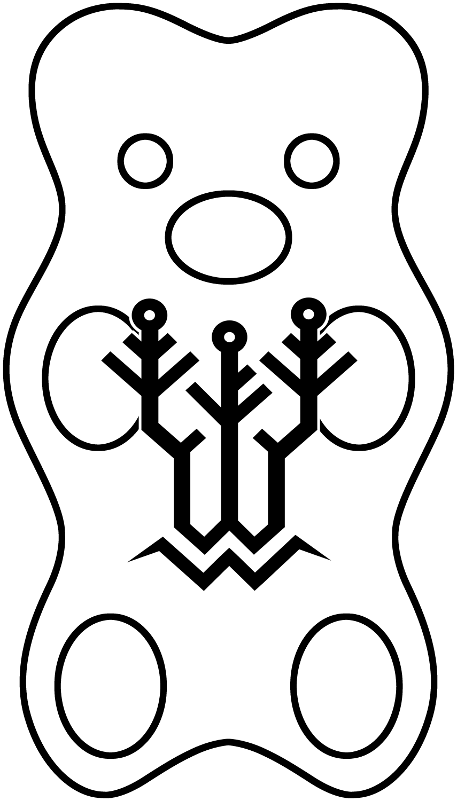

# All-in-One Prusa SKR Marlin Firmware (Beta)

__Not for production use. Use with caution!__

## About

This firmware is configured for a Bear/Tall Bear MK3S or Caribou fitted with a BigTreeTech SKR 1.4/Turbo and TMC2209s with optional upgrades like:
 - BigTreeTech dual mode TFT (TFT35/TFT50/TFT70/etc.) or WINSTAR OLED-based RepRapDiscount smart controller
 - BLTouch
 - Bondtech BMG extruder
 - NeoPixels
 - Planetary or 0.9° LDO/Moons stepper motors
 - Slice Engineering 450°C High Temperature thermistor
 - SuperPINDA

## Building Prusa SKR Firmware

To configure this firmware, edit [`Prusa_SKR_Configuration.h`](Marlin/Prusa_SKR_Configuration.h)

To build Prusa SKR Firmware you'll need [PlatformIO](https://docs.platformio.org/en/latest/ide.html#platformio-ide). Detailed setup instructions can be found on the [Building Marlin with PlatformIO for ReArm](https://marlinfw.org/docs/basics/install_rearm.html) guide.

## Helpful links

 - Chris Warkocki's [SKR Bear Github](https://github.com/codiac2600/SKR-Bear-Marlin), [SKR Bear wiring guide](https://github.com/codiac2600/SKR-MK3s-V1.4-Beta/blob/master/SKR%20MK3s%20Wire%20Guide.pdf), and [SKR Bear videos](https://youtube.com/c/ChrisWarkocki/search?query=skr+bear)
 - [Prusa Bear Upgrade Facebook group](https://facebook.com/groups/prusabearupgrade/)
 - [Prusa Community Facebook group](https://facebook.com/groups/675831176090951/)

## Credits

If you find this project helpful, please consider donating:

 - Chris Warkocki [[@codiac2600](https://github.com/codiac2600)], SKR Bear Project - [Patreon](https://patreon.com/chriswarkocki)
 - Keith Bennett [[@thisiskeithb](https://github.com/thisiskeithb)], Marlin tester/config builder - [Github Sponsors](https://github.com/sponsors/thisiskeithb)
 - Grégoire Saunier [[@gregsaun](https://github.com/gregsaun)], Prusa Bear Project - [Patreon](https://patreon.com/gregsaun)
 - Scott Lahteine [[@thinkyhead](https://github.com/thinkyhead)], Lead Marlin dev/maintainer - [Donate](https://www.thinkyhead.com/donate-to-marlin)

## License

Marlin and the Prusa SKR Firmware is published under the [GPL license](/LICENSE) because we believe in open development.